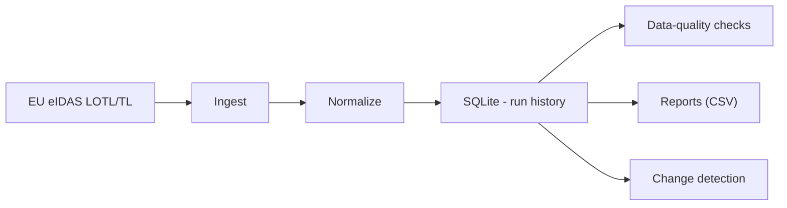
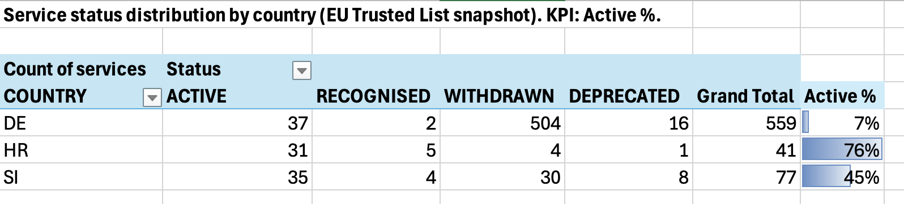

# eIDAS Trusted List Monitor

Lightweight monitoring pipeline that ingests EU eIDAS Trusted List (LOTL/TL) data, normalizes it into SQLite, runs data-quality checks, and produces reporting outputs for service status monitoring and change detection.

## Architecture



## Output (example)


**Active %** = ACTIVE / TOTAL services per country.

## Quickstart
```bash
python3 -m venv .venv
source .venv/bin/activate
pip install -r requirements.txt

python -m src.run_all
```
## Make targets
- `make run` — run pipeline (uses COUNTRIES if provided)
- `make test` — run tests
- `make clean` — delete local DB and generated artifacts

Example:
```bash
make run COUNTRIES=HR,DE
make test
```

What gets generated
- eidastl.sqlite — local SQLite database with run history (not committed)
- reports/ — CSV outputs (not committed)
- dq_results/ — data quality checks per run
- change_log/ — detected differences between runs

Excel / Pivot view
1. Open reports/services_status_summary_pretty.csv in Excel
2. Insert PivotTable:
- Rows: COUNTRY
- Columns: status_label
- Values: Sum of n_services
3. Enable Grand Total
4. Add KPI column Active % outside pivot: =ACTIVE/GrandTotal
5. Add conditional formatting (data bars) for Active %

Notes
- Generated artifacts (`eidastl.sqlite`, `reports/`) are not committed.
- Designed for reproducible runs with traceability (run history + change logs).
- Focus on data quality checks to catch schema/consistency issues early.