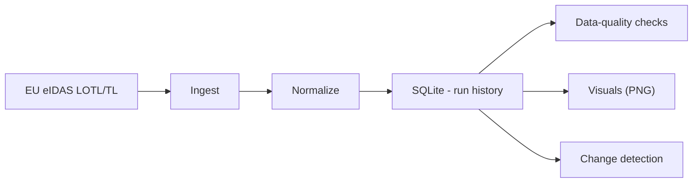
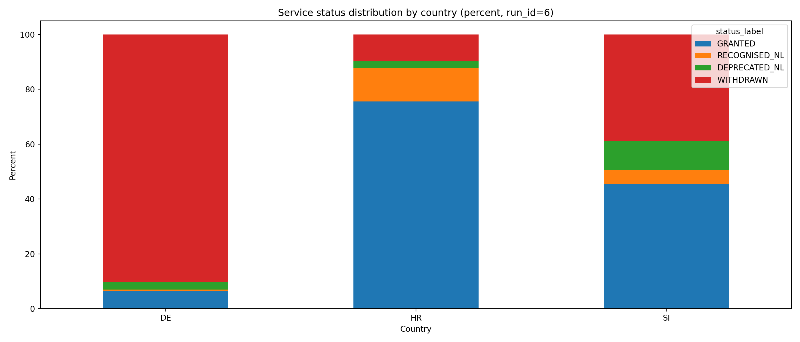
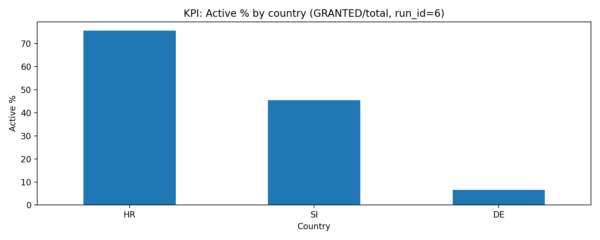
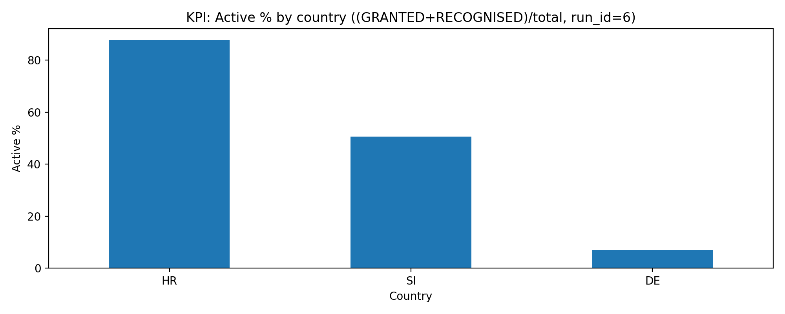
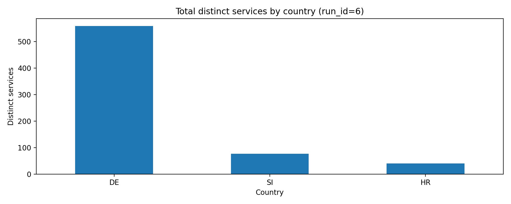

# eIDAS Trusted List Monitor

Lightweight monitoring pipeline that ingests EU eIDAS Trusted List (LOTL/TL) data, normalizes it into SQLite, runs data-quality checks, and produces reporting outputs for service status monitoring and change detection.

## Architecture



## Output (auto-generated)

Active % is computed as:
- **GRANTED / TOTAL** (strict)
- optionally **(GRANTED + RECOGNISED) / TOTAL** (broader)

### Visuals








## Quickstart
```bash
python3 -m venv .venv
source .venv/bin/activate
python -m pip install -r requirements.txt

python -m src.run_all
python -m src.make_visuals_from_sqlite
```
## Make targets
- `make run` — run pipeline (uses COUNTRIES if provided)
- `make test` — run tests
- `make clean` — delete local DB and generated artifacts

Example:
```bash
make run COUNTRIES=HR,DE
make test
```

## What gets generated
- dashboard_screenshots/auto/ — PNG visuals (committed)
- eidastl.sqlite — local SQLite database with run history (not committed)
- dq_results (table) — data quality checks per run
- change_log (table) — detected differences between runs


## Notes
- eidastl.sqlite is generated locally and not committed.
- dashboard_screenshots/auto/*.png are committed as reproducible outputs.
- Designed for reproducible runs with traceability (run history + change logs).
- Focus on data quality checks to catch schema/consistency issues early.